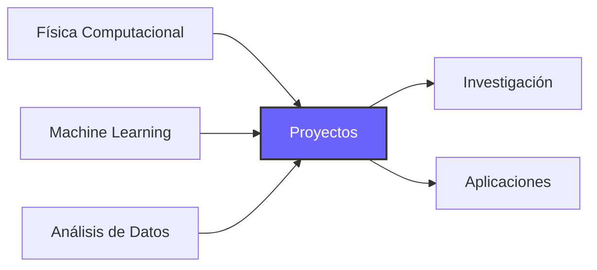

<div align="center">


<br>

###  Físico | ML | Ciencia de Datos

<br>

---

</div>

##  Sobre mí

<table>
<tr>
<td width="50%">

```python
class Juan_mdn:
    def __init__(self):
        self.interests = [
            "Física teórica",
            "Análisis de Datos",
            "Machine Learning",
            "Métodos Numéricos"
        ]
        self.current_focus = "Physics | ML & AI"
        self.philosophy = "Construyendo conocimiento, un repositorio a la vez "
    
    def explore(self):
        return "Siempre aprendiendo "
```

</td>
<td width="50%">

###  Mi Enfoque

Combino **física**, **matemáticas** y **programación** para resolver los problemas que me interesan. Busco transformar teoría física en código funcional y explorar cómo el machine learning puede aplicarse a conceptos de física y matemáticas.

</td>
</tr>
</table>

---

##  Repositorios Destacados

<div align="center">

<table>
<tr>
<td width="50%" valign="top">

###  Physics & Numerical Methods
[](https://github.com/juareymal-ui/Portfolio-Roadmap-Physics-Numerical-Methods.)

**Implementaciones computacionales**

Métodos numéricos y algoritmos para resolver problemas físicos mediante computación científica.

🔹 Ecuaciones diferenciales  
🔹 Simulaciones físicas  
🔹 Métodos de integración  
🔹 Análisis numérico  

</td>
<td width="50%" valign="top">

###  Machine Learning & Deep Learning
[](https://github.com/juareymal-ui/ML-AI-Lecture-Notes)

**Aprendizaje automático & IA**

Apuntes y experimentos en inteligencia artificial y técnicas de machine learning.

🔹 Algoritmos de ML  
🔹 Redes neuronales  
🔹 Proyectos prácticos  
🔹 Teoría y aplicación  

</td>
</tr>
</table>

</div>

---

## Stack Tecnológico

<div align="center">

### Lenguajes y Herramientas

<p>


</p>

### Librerías de Data Science & ML

<p>


</p>

<p>


</p>

### Control de Versiones & Herramientas

<p>


</p>

</div>

### Áreas de Expertise

<table>
</td>
<td align="center" width="25%">

<br><br>
<sub>Aprendizaje automático </sub>
</td>
<td align="center" width="25%">

<br><br>
<sub>Algoritmos numéricos y simulaciones</sub>
</td>
<td align="center" width="25%">

<br><br>
<sub>Análisis y visualización de datos</sub>
</td>
<td align="center" width="25%">

<br><br>
<sub>Computación científica aplicada</sub>
</td>
</tr>
</table>

</div>

---

##  GitHub Stats

<div align="center">


</div>

---

##  Actualmente Explorando

<div align="center">



</div>

-  Profundizando en **Deep Learning** y sus aplicaciones
-  Explorando **algoritmos y métodos numéricos avanzados** para física
-  Abierto a colaboraciones en **proyectos de física y ML**
-  Pregúntame sobre **Python, ML o métodos numéricos**

---

## Conecta Conmigo

<div align="center">

[](https://www.linkedin.com/in/juan-de-jes%C3%BAs-reyes-maldonado-b7475a2b9/)
[](mailto:lessjuareymal@gmail.com)

<br>

---

<br>


</div>
