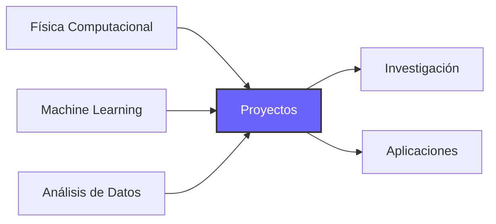

<div align="center">

#  ¡Hola! Soy Juan Maldonado


<br>

### 🔬 Físico | 🤖 Entusiasta de ML | 📊 Ciencia de Datos

<br>

---

</div>

##  Sobre mí

<table>
<tr>
<td width="50%">

```python
class JuanAreymal:
    def __init__(self):
        self.interests = [
            "Métodos Numéricos",
            "Machine Learning",
            "Física Computacional",
            "Análisis de Datos"
        ]
        self.current_focus = "ML & AI"
        self.philosophy = "Construyendo conocimiento, un repositorio a la vez 🚀"
    
    def explore(self):
        return "Siempre aprendiendo 📚"
```

</td>
<td width="50%">

###  Mi Enfoque

Combino **física**, **matemáticas** y **programación** para resolver problemas complejos. Me apasiona transformar física teoría en código funcional y explorar cómo el machine learning puede aplicarse a conceptos de física y matemáticas.

</td>
</tr>
</table>

---

##  Repositorios Destacados

<div align="center">

<table>
<tr>
<td width="50%" valign="top">

###  Physics & Numerical Methods
[](https://github.com/juareymal-ui/Physics_Numerical_Methods)

**Implementaciones computacionales**

Métodos numéricos y algoritmos para resolver problemas físicos mediante computación científica.

🔹 Ecuaciones diferenciales  
🔹 Simulaciones físicas  
🔹 Métodos de integración  
🔹 Análisis numérico  

</td>
<td width="50%" valign="top">

###  ML & AI Lecture Notes
[](https://github.com/juareymal-ui/ML_AI_Lecture_Notes)

**Aprendizaje automático & IA**

Apuntes y experimentos en inteligencia artificial y técnicas de machine learning.

🔹 Algoritmos de ML  
🔹 Redes neuronales  
🔹 Proyectos prácticos  
🔹 Teoría y aplicación  

</td>
</tr>
</table>

</div>

---

##  Stack Tecnológico

<div align="center">

### Lenguajes y Herramientas

<p>


</p>

<p>


</p>

### Áreas de Expertise

<table>
<tr>
<td align="center" width="25%">

<br><br>
<sub>Aprendizaje automático y modelos predictivos</sub>
</td>
<td align="center" width="25%">

<br><br>
<sub>Algoritmos numéricos y simulaciones</sub>
</td>
<td align="center" width="25%">

<br><br>
<sub>Análisis y visualización de datos</sub>
</td>
<td align="center" width="25%">

<br><br>
<sub>Computación científica aplicada</sub>
</td>
</tr>
</table>

</div>

---

##  GitHub Stats

<div align="center">


</div>

---

##  Actualmente Explorando

<div align="center">


```mermaid
graph LR
    A[Física Computacional] --> D[Proyectos]
    B[Machine Learning] --> D
    C[Análisis de Datos] --> D
    D --> E[Investigación]
    D --> F[Aplicaciones]
    style D fill:#6C63FF,stroke:#333,stroke-width:2px,color:#fff
```

</div>

-  Profundizando en **Deep Learning** y sus aplicaciones
-  Explorando **algoritmos y métodos numéricos avanzados** para física
-  Abierto a colaboraciones en **proyectos de física y ML**
-  Pregúntame sobre **Python, ML o métodos numéricos**

---

##  Conecta Conmigo

<div align="center">

[](https://github.com/juareymal-ui)
[](mailto:tu-email@example.com)

<br>

---

<br>


</div>
